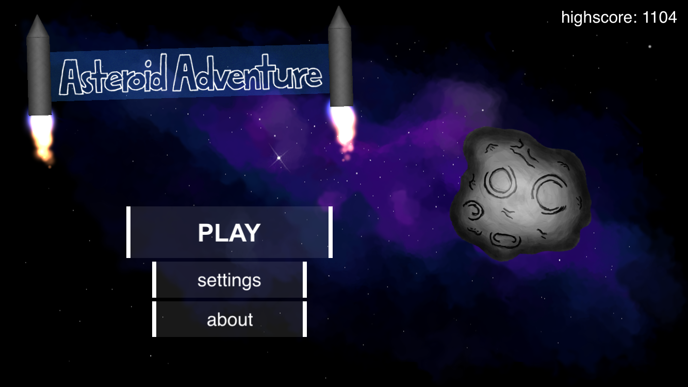
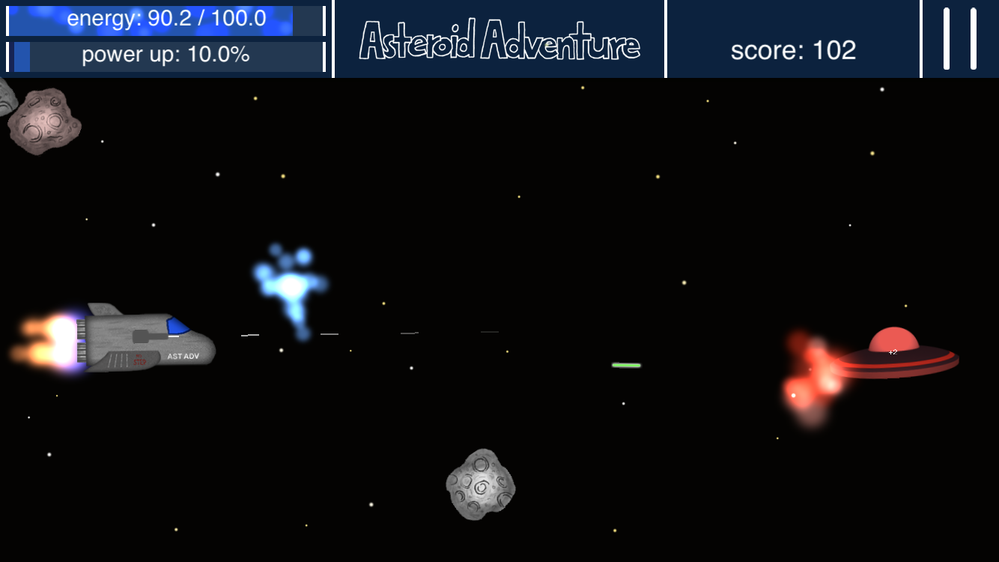
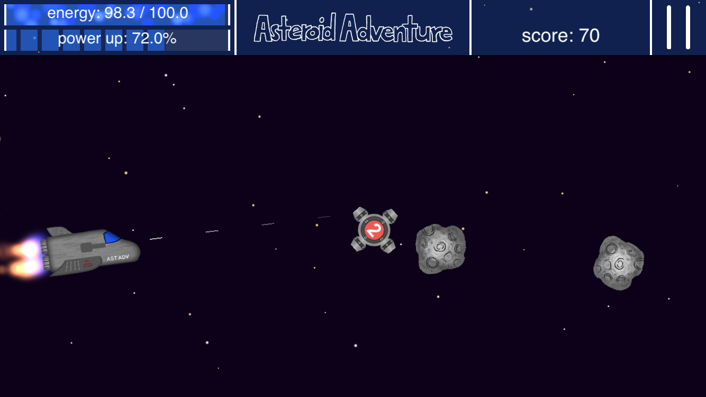

# Asteroid Adventure

Asteroid Adventure is a little iOS space shooter which I programmed to get started with iOS app development with Xcode, Swift and SpriteKit. The game was programmed in Swift 2 and wasn't updated to newer Swift versions.

### Gameplay

The game not only features asteroids to avoid but also other types of enemies such as bombs with a countdown and other spaceships that try to shoot the player.

The player can also collect powerups such as stronger or multiple lasers or activate his shield. All these actions consume energy without with the game is over.

